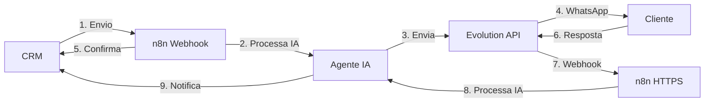

# Configuração do n8n para Integração com CRM

## Visão Geral

Este documento explica como configurar os workflows do n8n para integrar com o CRM, permitindo que o agente de IA processe mensagens de entrada e saída.

## Arquitetura



## Workflows Necessários

### 1. Workflow de Envio (CRM → WhatsApp)

**URL do Webhook**: `https://seu-n8n.com/webhook/crm-send`

#### Nodes do Workflow:

1. **Webhook (Trigger)**
   - Method: POST
   - Path: `crm-send`
   - Response: Immediately

2. **Function Node - Processar Dados**
   ```javascript
   // Extrair dados do CRM
   const contactId = $json.contactId;
   const phone = $json.phone;
   const name = $json.name;
   const content = $json.content;
   const mediaUrl = $json.mediaUrl;
   const mediaType = $json.mediaType;
   
   return {
     contactId,
     phone,
     name,
     content,
     mediaUrl,
     mediaType,
     timestamp: new Date().toISOString()
   };
   ```

3. **AI Agent Node (Opcional)**
   - Se você quiser que o agente IA processe/melhore a mensagem antes de enviar
   - Configure seu agente aqui
   - Pode adicionar contexto, corrigir gramática, etc.

4. **HTTP Request - Enviar via Evolution API**
   - Method: POST
   - URL: `{{$env.EVOLUTION_API_URL}}/message/sendText/{{$env.EVOLUTION_INSTANCE}}`
   - Headers:
     - `apikey`: `{{$env.EVOLUTION_API_TOKEN}}`
     - `Content-Type`: `application/json`
   - Body:
     ```json
     {
       "number": "{{ $json.phone }}",
       "text": "{{ $json.content }}"
     }
     ```

5. **HTTP Request - Notificar CRM**
   - Method: POST
   - URL: `{{$env.CRM_URL}}/api/webhooks/n8n-sent`
   - Headers:
     - `Content-Type`: `application/json`
   - Body:
     ```json
     {
       "contactId": "{{ $json.contactId }}",
       "content": "{{ $json.content }}",
       "mediaUrl": "{{ $json.mediaUrl }}",
       "mediaType": "{{ $json.mediaType }}",
       "messageId": "{{ $json.messageId || $now }}",
       "timestamp": "{{ $json.timestamp }}"
     }
     ```

---

### 2. Workflow de Recebimento (WhatsApp → CRM)

**URL do Webhook**: Configure na Evolution API para apontar para seu n8n

#### Nodes do Workflow:

1. **Webhook HTTPS (Trigger)**
   - Method: POST
   - Path: `evolution-incoming`
   - Authentication: None (ou configure se preferir)

2. **Function Node - Extrair Dados**
   ```javascript
   // Processar payload da Evolution API
   let payload = $input.all()[0].json;
   
   // Lidar com diferentes formatos
   if (Array.isArray(payload) && payload.length > 0) {
     payload = payload[0];
   } else if (payload && payload.body) {
     payload = payload.body;
   }
   
   const data = payload.data || payload;
   const msgData = data.message || data;
   
   // Extrair informações
   const phone = data.key.remoteJid.split('@')[0];
   const content = msgData.conversation || 
                   msgData.extendedTextMessage?.text || 
                   'Mídia recebida';
   
   return {
     phone,
     content,
     pushName: data.pushName || phone,
     timestamp: new Date().toISOString(),
     fromMe: data.key.fromMe
   };
   ```

3. **IF Node - Verificar se não é mensagem própria**
   - Condition: `{{ $json.fromMe }}` equals `false`

4. **AI Agent Node**
   - Configure seu agente de IA aqui
   - Processa a mensagem recebida
   - Gera resposta automática (se aplicável)

5. **Switch Node - Decidir se responder**
   - Baseado na resposta do agente IA
   - Se deve responder automaticamente ou apenas notificar CRM

6. **HTTP Request - Enviar Resposta (se necessário)**
   - Method: POST
   - URL: `{{$env.EVOLUTION_API_URL}}/message/sendText/{{$env.EVOLUTION_INSTANCE}}`
   - Headers:
     - `apikey`: `{{$env.EVOLUTION_API_TOKEN}}`
   - Body:
     ```json
     {
       "number": "{{ $json.phone }}",
       "text": "{{ $json.aiResponse }}"
     }
     ```

7. **HTTP Request - Notificar CRM (Mensagem Recebida)**
   - Method: POST
   - URL: `{{$env.CRM_URL}}/api/webhooks/evolution`
   - Headers:
     - `Content-Type`: `application/json`
   - Body: Repassar payload original da Evolution

8. **HTTP Request - Notificar CRM (Resposta Enviada)**
   - Method: POST
   - URL: `{{$env.CRM_URL}}/api/webhooks/n8n-sent`
   - Body:
     ```json
     {
       "contactId": "{{ $json.contactId }}",
       "content": "{{ $json.aiResponse }}",
       "messageId": "{{ $now }}",
       "timestamp": "{{ $json.timestamp }}"
     }
     ```

---

## Variáveis de Ambiente no n8n

Configure as seguintes variáveis no n8n:

```env
EVOLUTION_API_URL=https://evolution-evolution-api.wz7hqa.easypanel.host
EVOLUTION_API_TOKEN=429683C4C977415CAAFCCE10F7D57E11
EVOLUTION_INSTANCE=clinica
CRM_URL=http://seu-crm.com:3001
```

---

## Configuração no CRM

No arquivo `.env` do CRM, configure:

```env
N8N_WEBHOOK_URL=https://seu-n8n.com/webhook/crm-send
```

---

## Payloads de Exemplo

### CRM → n8n (Envio)
```json
{
  "contactId": "abc123",
  "phone": "5531999999999",
  "name": "João Silva",
  "content": "Olá, tudo bem?",
  "mediaUrl": null,
  "mediaType": null,
  "timestamp": "2024-12-24T10:00:00.000Z"
}
```

### n8n → CRM (Confirmação)
```json
{
  "contactId": "abc123",
  "content": "Olá, tudo bem?",
  "mediaUrl": null,
  "mediaType": null,
  "messageId": "msg_12345",
  "timestamp": "2024-12-24T10:00:00.000Z"
}
```

### Evolution → n8n (Recebimento)
```json
{
  "event": "messages.upsert",
  "data": {
    "key": {
      "remoteJid": "5531999999999@s.whatsapp.net",
      "fromMe": false
    },
    "pushName": "João Silva",
    "message": {
      "conversation": "Oi, preciso de ajuda"
    }
  }
}
```

---

## Testes

### 1. Testar Envio
```bash
# Enviar mensagem pelo CRM
curl -X POST http://localhost:3001/api/messages \
  -H "Authorization: Bearer SEU_TOKEN" \
  -H "Content-Type: application/json" \
  -d '{
    "contactId": "CONTACT_ID",
    "content": "Teste via n8n"
  }'
```

### 2. Testar Confirmação
```bash
# Simular confirmação do n8n
curl -X POST http://localhost:3001/api/webhooks/n8n-sent \
  -H "Content-Type: application/json" \
  -d '{
    "contactId": "CONTACT_ID",
    "content": "Teste",
    "messageId": "test123",
    "timestamp": "2024-12-24T10:00:00.000Z"
  }'
```

---

## Troubleshooting

### Mensagens não aparecem no CRM

1. **Verificar logs do n8n**
   - Confirme que o webhook está sendo chamado
   - Verifique se há erros no workflow

2. **Verificar logs do CRM**
   - Procure por `[CRM] Recebendo confirmação de envio do n8n`
   - Verifique se há erros de salvamento no banco

3. **Verificar Socket.io**
   - Abra o console do navegador
   - Verifique se está conectado ao socket
   - Procure por eventos `message:new`

### Mensagens duplicadas

- O endpoint `/api/webhooks/n8n-sent` verifica duplicatas por `messageId`
- Certifique-se de que o n8n está enviando um `messageId` único

### Timeout ao enviar

- O timeout padrão é 10 segundos
- Se o n8n demorar mais, aumente o timeout no código
- Ou configure o n8n para responder mais rápido

---

## Fluxo Completo de Exemplo

1. **Operador envia mensagem no CRM**
   - CRM chama `POST /api/messages`
   - Backend envia para n8n webhook

2. **n8n processa**
   - Recebe no webhook `crm-send`
   - Agente IA pode processar (opcional)
   - Envia via Evolution API
   - Notifica CRM via `POST /api/webhooks/n8n-sent`

3. **CRM recebe confirmação**
   - Salva mensagem no banco
   - Emite via Socket.io
   - Interface atualiza em tempo real

4. **Cliente responde no WhatsApp**
   - Evolution envia para n8n webhook
   - n8n processa com agente IA
   - Agente decide se responde automaticamente
   - n8n notifica CRM via `POST /api/webhooks/evolution`
   - CRM salva e exibe mensagem

---

## Próximos Passos

1. Configure os workflows no n8n conforme descrito
2. Atualize as variáveis de ambiente
3. Teste o fluxo completo
4. Ajuste o comportamento do agente IA conforme necessário
